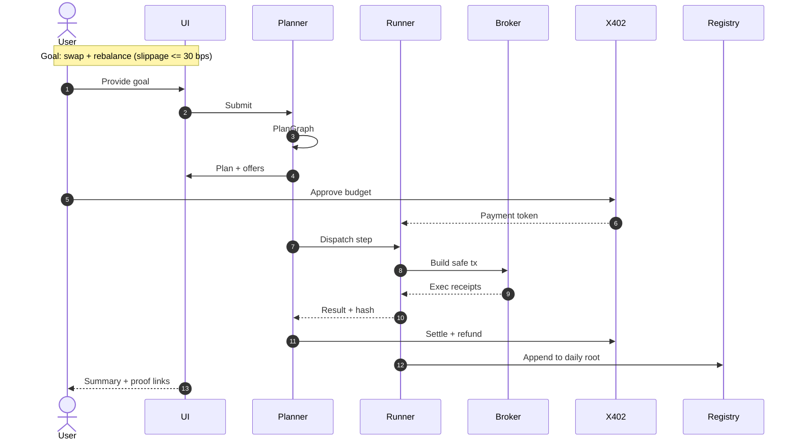
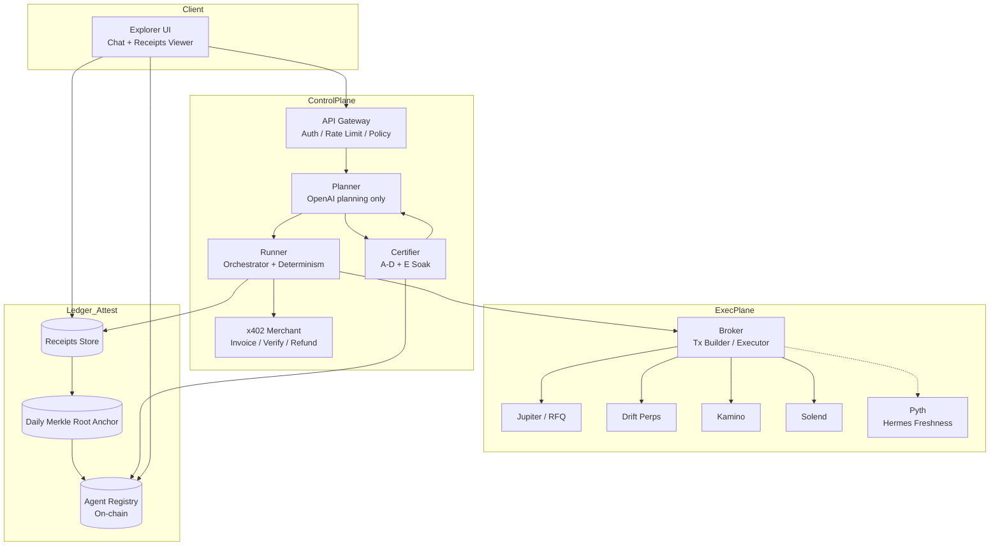
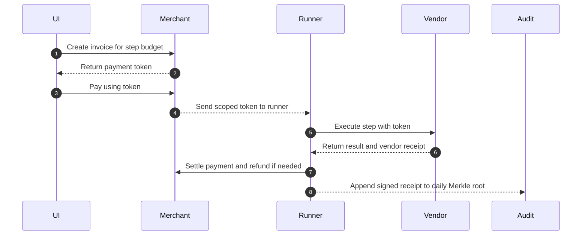
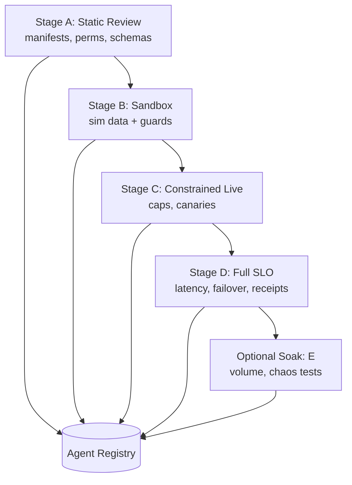
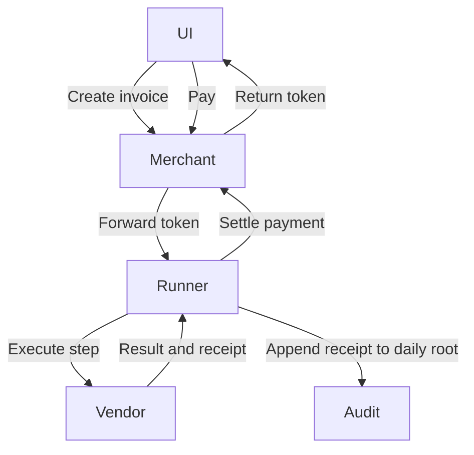

# AgentRunner — App Store for Smart DeFi Agents

*A payments-native, audit-first marketplace where AI agents plan, hire, pay (via x402), and execute safely on Solana — with signed receipts and on-chain anchoring.*

---

## 1) What is AgentRunner? (One-liner + Elevator Pitch)

AgentRunner is a Solana-first platform where users describe a DeFi goal (e.g., "Swap 1 SOL->USDC <=30 bps; rebalance to 60/30/10"), and a planning agent composes a safe plan, requests bids from specialized execution agents, pays per step with x402 (HTTP-402 micropayments), executes on-chain with strict risk rails, and emits signed receipts. Receipts roll into a daily Merkle root anchored on-chain for provable auditability. Developers list their agents in a marketplace, pass a multi-stage certification, and monetize per request.

---

## 2) Why Now

* **Fragmentation**: Users hop between TradingView, DEXes, analytics, telegram bots; there’s no unified "do-it-for-me" layer.
* **Trust & Safety**: "Black-box bots" and Telegram UIs lack guardrails, receipts, and auditability.
* **Payments Gap**: Agents need per-request, machine-payable APIs and skills. x402 finally enables native pay-as-you-go over HTTP.
* **Throughput**: Solana’s speed/fees + reliable price oracles (e.g., Pyth Hermes freshness) suit real-time agent execution.

---

## 3) Core Concepts & Roles

* **Planner**: Creates a **PlanGraph** (steps, guards, costs) from a user goal; can hire other agents.
* **RFP & Offers**: Planner posts an RFP; vendors respond with **offers** (price, SLOs, constraints).
* **Runner**: Executes approved plan steps with **deterministic replay** and **risk rails**.
* **Broker**: Transaction builder/executor for Solana venues (Jupiter, Drift, Kamino, Solend), with **slippage caps**, **oracle freshness** checks, and **fee rails**.
* **x402 Merchant**: Invoices, verifies, refunds — **per-request payments** with receipts.
* **Certifier**: Auto-cert pipeline (Stages **A-D**, optional **E Soak**) validating determinism, safety, and SLOs before marketplace listing.
* **Agent Registry**: On-chain identity, versions, attestations; **daily Merkle roots** of receipts anchored for audit trails.
* **Explorer UI**: Chat-first UX to plan, review bids, authorize payments, and inspect receipts.

---

## 4) End-to-End Lifecycle (High-Level)

---

## 5) System Architecture (Context Overview)

---

## 6) What Each Project/Service Does (No repo layout; conceptual only)

* **Planner**: Converts natural-language goals into a **PlanGraph** with steps, dependency edges, guardrails (slippage, oracle freshness), estimated costs, and candidate agents.
* **RFP/Marketplace**: Broadcasts capability needs; collects **offers** with price, SLO, coverage, risk statements; picks vendors by utility (cost x reliability x guard compatibility).
* **Runner**: Orchestrates steps, enforces **policy-as-code** (allowlists, venue caps, per-step budgets), logs **deterministic execution traces** for replay/audit.
* **x402 Merchant**: Issues per-step **invoices**; returns **payment tokens** to authorize specific actions; handles **refunds** for unused budget; emits **payment receipts**.
* **Broker**: Encodes execution risk rails: **max slippage bps**, **Pyth freshness thresholds**, **Jito priority fee caps**, **route reliability** fallbacks; assembles and sends transactions; collects signed receipts.
* **Certifier**: Auto-cert pipeline across **Stage A (static checks)** -> **B (sandbox runs)** -> **C (constrained live)** -> **D (full SLO)**; optional **E (soak)**. Generates public attestations for **Agent Registry**.
* **Agent Registry (on-chain)**: Stores agent identity, versions, and certification status; records **daily Merkle roots** for immutable proof of receipts integrity.
* **Explorer UI**: Chat interface, offer comparison, explicit approval & budget, and a **receipts viewer** with links to on-chain anchors and vendor attestations.

---

## 7) Request -> Plan -> Hire -> Pay -> Execute (Detailed)

* **Guards**: slippage bps caps, oracle max-age, venue/route allowlists, fee ceilings, min liquidity.
* **Receipts**: include inputs, decisions, on-chain txids, costs, timestamps, checksums — sufficient for **deterministic replay**.
* **Anchoring**: daily **Merkle root** (of all receipts) anchored on-chain; UI links allow third-party verification.

---

## 8) Safety, Risk Rails & Determinism

* **Oracle Freshness**: Enforce max age; abort or re-quote if stale.
* **Slippage & Route Reliability**: Pre-trade estimates; route fallback if dispersion exceeds threshold.
* **Fees & Priority**: Bound Jito priority fees to budget; reject runs exceeding caps.
* **Liquidity, Health & Margin**: Venue-specific guards (e.g., Drift index vs mark deltas, OI caps).
* **Policy-as-Code**: Tenanted allowlists (assets, venues), daily budget caps, approval gates.
* **Deterministic Replay**: All decisions are logged with **point-in-time** references; same inputs reproduce the same plan/execution.

---

## 9) Certification Pipeline (A-D + E Soak)

* **Outputs**: Attestation bundle (SLO stats, failure modes, supported guards), public badges, and version pins in the **Registry**.

---

## 10) Payments & Receipts (x402-Native)

* **Properties**: Fine-grained scope (step/time/budget), **revocable tokens**, **auto-refunds**, and machine-verifiable logs.

---

## 11) Explorer UX (What a user sees)

* **Chat**: "Tell me your DeFi goal…"
* **Offer Compare**: Price, SLOs, risk guards, certification level.
* **Explicit Approval**: Budget per step; x402 invoice link.
* **Live Status**: Planning -> RFP -> Offers -> Hiring -> Executing -> Completed.
* **Receipts Drawer**: Per step logs, txids, payment details, guard checks, and **on-chain anchor** link.

---

## 12) Example Journeys

* **Retail DeFi**: "Swap 1 SOL->USDC <=30 bps; then DCA 5 times." Picks best offer, pays per step, gets receipts + anchor proof.
* **Portfolio Ops**: "Rebalance to 60/30/10 using low-slippage routes; cap fees at 5 bps; exit LP if volatility spikes."
* **Fund Admin (NAVOps)**: Agent pulls positions, prices with oracle freshness checks, emits audit receipts; external auditor can verify via daily root.
* **BFSI Agents (e.g., PRISM)**: Supervisor agents trigger ECL/termination-risk workflows, hiring certified DeFi agents only under policy caps.

---

## 13) Developer Experience (Vendors)

* **Manifest**: Capabilities, inputs/outputs, guard compatibility, price model, SLO targets.
* **Determinism**: Provide stable outputs under PIT data; supply proofs in certification.
* **Receipts**: Emit signed per-step receipts; expose counters for health and latency.
* **Versioning**: Semantic versions pinned in Registry; rolling upgrades gated by attestation deltas.
* **Monetization**: x402 per-request; optional tiered SLO pricing.

---

## 14) Governance, Compliance, & Enterprise Readiness

* **Tenancy & Isolation**: Per-tenant policy sets, budgets, allowlists, and secrets.
* **Approvals**: Dual-control for large budgets; role-based review of plans/steps.
* **Observability**: Full logs, metrics, receipts API; SIEM integration.
* **Data**: PIT lineage; optional data residency modes; encryption at rest/in flight.
* **Audits**: Receipts -> Merkle root -> on-chain anchor; third-party verifiers can independently validate.

---

## 15) Performance & SLOs (Illustrative Targets)

* **Plan synthesis**: p95 < 1.5s
* **Quote -> Fill loop**: p95 < 2s under normal load
* **Receipt availability**: < 1s post-fill
* **Anchor cadence**: Daily (configurable)

---

## 16) Roadmap (Near-Term)

* **Devnet-first demo** with seeded vendor sims.
* **Auto-Cert v1** (A-D) wired to Registry + public badges.
* **Receipts Viewer** with per-step drill-down and anchor proofs.
* **RFP v1** with utility-based vendor selection.

---

## 17) Glossary

* **PlanGraph**: Directed graph of steps with guards and costs.
* **Guards**: Hard constraints (slippage bps, oracle age, fee caps, allowlists).
* **Receipts**: Signed records of inputs, decisions, txids, costs, outcomes.
* **Merkle Root**: Commitment to all receipts for a period; anchored on-chain for immutability.
* **Certification**: Progressive testing & attestation pipeline for agent safety and reliability.
* **x402**: HTTP-native micropayments (402 status) enabling agent-to-agent machine payments.

---

## 18) Future Vision (Detailed)

### 18.1 Agent Credit Layer (Reputation, BNPL)

* **Reputation Graph**: Derive per-agent and per-vendor scores from **anchored receipts**: fill quality, slippage vs promise, SLO adherence, refund rates, incident flags.
* **BNPL for Agents**: High-reputation agents receive micro-credit lines to start work **before** funds settle (bounded by policy, revocable on breach).
* **Risk Pricing**: Dynamic pricing of BNPL lines using **historical receipts** (loss severity, task volatility, venue risk).
* **Counterparty Insurance**: Slashing/staking pools where agents/vendors bond against misbehavior; payouts triggered by **verifiable receipt breaches**.
* **Enterprise Controls**: Per-tenant credit exposure caps; auditor views over credit decisions; exportable **credit attestations**.

### 18.2 ZK Proofs for Trustless Agent Actions

* **ZK-Attested Steps**: For critical steps (pricing, routing, compliance checks), emit **succinct ZK proofs** that the agent:

  1. Used inputs matching PIT snapshots,
  2. Applied policy-approved algorithms (e.g., slippage calc), and
  3. Produced outputs consistent with constraints.
* **Privacy-Preserving Offers**: Vendors can prove capability/SLO compliance **without revealing proprietary models/alpha**.
* **Selective Disclosure**: Auditors verify correctness from proofs + anchors; sensitive business logic stays private.
* **ZK-Receipts**: Extend receipts with **proof commitments**; Merkle roots commit to both data and proofs.

### 18.3 Multi-Chain Expansion & Enterprise Control

* **Multi-Chain**: Add EVM (Ethereum, Base), Cosmos, and specialized L2s; **abstracted Broker** selects the best venue by **cost x reliability x latency** while keeping **uniform risk rails**.
* **Unified Policy Engine**: One policy model across chains — assets, venues, fee caps, oracle freshness.
* **Enterprise Guardrails**: SSO/SAML, SCIM, VPC peering, **HSM/KMS** for key custody, **just-in-time approvals**, immutable retention buckets for receipts, **SOC2** controls.
* **Private Marketplaces**: Enterprises run curated, internal agent catalogs with the same certification and anchoring; export public attestations when desired.
* **Cross-Chain Proofs**: Use **on-chain attest bridges** so receipts anchored on one chain can be referenced and verified from another (for multi-venue audits).

---

## 19) FAQs (Concise)

* **What does OpenAI do here?** Planning only. Execution is deterministic with strict guards.
* **How do I know it’s safe?** Certified agents, policy gates, per-step budgets, receipts, and daily on-chain anchors.
* **How do vendors get paid?** Per request/step via x402; refunds auto-handled; all payments are receipted.
* **Can I audit later?** Yes. Use receipts + Merkle root anchor to independently verify.

---

## 20) Call to Action

* **Users**: Describe your goal and compare certified offers before approving budget.
* **Vendors**: Package your agent, pass **A-D** certification, and start earning with x402.
* **Enterprises**: Bring your policies, run a private marketplace, and integrate receipts into your audit stack.

---

